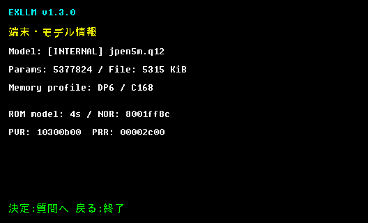
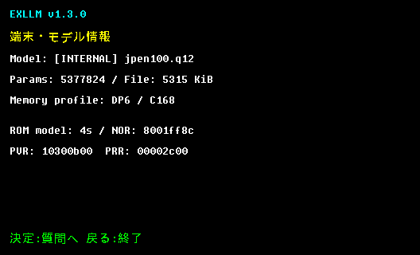
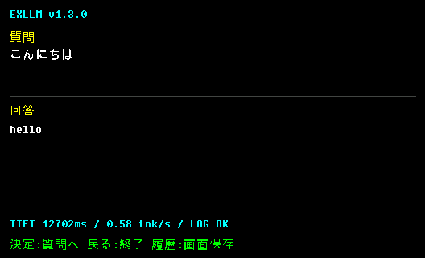
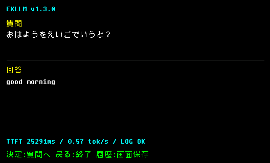

# 固定5M級アーキテクチャにおける学習量と一般化のケーススタディ

作成日: 2026-09-29  
対象: EXLLM原本、EXLLM-JPTOENの非公開親checkpoint、EXLLM-JPTOEN

> この資料は「どのモデルが高性能か」という順位表ではない。固定アーキテクチャで学習トークン量とデータ分布を変えたとき、記憶、学習済み表現、未知構文への一般化がどう変化したかを記録する。

## 結論

3checkpointは同じ5M級アーキテクチャと同じEXQ12容量を共有するが、同じ能力を段階的に伸ばした単純な三世代ではない。EXLLM原本は短い日本語応答、EXLLM-JPTOEN系統はかな入力から英語を返す辞書タスクへ目的を変更している。したがって、原本とEXLLM-JPTOENの正解率は同じ尺度で順位付けできない。

非公開親checkpointとEXLLM-JPTOENを比較すると、100,003,620 processed-token checkpointは266語の記憶と学習済み質問形式への適合を大幅に強めた。一方、学習で一度も使わなかった質問構文への正解は34/266に留まり、5M級モデルが一般的な文法理解を獲得したとはいえない。

## 共通条件

| 項目 | 値 |
|---|---:|
| unique parameters | 5,377,824 |
| layers | 6 |
| hidden size | 288 |
| FFN size | 896 |
| heads | 9 |
| vocabulary | 868 |
| context | 128 tokens |
| EXQ12 tensors | 39 |
| EXQ12 size | 5,443,105 bytes |
| 実機 | CASIO XD-B4800 / DATAPLUS 6 |

同じ実機runtime、同じパラメータ数、同じ量子化後ファイルサイズなので、モデル間の実機速度差は原則として回答token数と入力token数によって生じる。学習量そのものは1 tokenあたりの行列演算量を変えない。

## モデル別概要

| モデル | 主目的 | 学習・選定情報 | 代表的なhost評価 |
|---|---|---|---|
| EXLLM原本 v1.1 5M | 短い日本語応答、定型知識、拒否、整数計算 | global step 1,810。公開stage行数合計86,408件（重複を含む） | semantic 35/35、calculator 300/300、fuzz 200/200、sampling 48/48 |
| 非公開親checkpoint | かな入力による日英辞書 | 2,901,546 processed non-padding tokens、266語 | canonical 245/266、bare 244/266、held-out prompt 149/266、real unknown 38/43、device regression 6/6 |
| EXLLM-JPTOEN | 同じ266語と未知語拒否を大量反復・多様化 | 100,003,620 processed non-padding tokens。追加97,102,074 tokens | bare 266/266、known query 262/266、fully unseen template 34/266、ambiguous 12/12、nonce 62/64、device regression 6/6 |

評価集合はモデル間で完全には共通ではない。特にEXLLM原本の35件semantic gateとEXLLM-JPTOENの辞書評価を直接比較して、どちらが「高性能」と結論づけることはできない。

## EXLLM-JPTOENと非公開親checkpoint

### 完全共通ケースの比較

次の表は、両評価JSONでpromptとexpectedがバイト単位で一致するケースだけを比較したもである。異なるholdout集合の数値は同じ表に混ぜない。全ケースと入力JSONのhashは[`common-eval-int8.json`](../../benchmarks/jptoen/common-eval-int8.json)、再生成スクリプトは[`build_jptoen_common_eval.py`](../../eval/build_jptoen_common_eval.py)にある。

| 共通評価群 | 共通件数 | 非公開親 | EXLLM-JPTOEN |
|---|---:|---:|---:|
| bare known | 266 | 244 | 266 |
| ambiguous unknown | 2 | 2 | 2 |
| general OOD | 3 | 3 | 3 |
| device regression | 4 | 4 | 4 |

この共通表から直接言える改善は、bare-known 22件の増加である。その他の共通集合は小さく、一般化性能全体の改善を示すものではない。

### 改善した点

- bare known wordsは244/266から266/266になった。
- 学習分布に近い質問形式は、追加学習後の評価で262/266となった。
- 曖昧語拒否は12/12を維持した。
- device regressionは6/6を維持した。
- FP32とdequantized INT8の100M版評価結果は一致した。
- 評価した出力925件はすべて表示可能なASCIIだった。

### 改善しなかった点

- 完全未使用の質問テンプレートは34/266だった。
- nonce未知語は62/64で、2件を既知英単語へ誤対応した。
- real-word unknown holdoutは22/40だが、失敗には`たまご → egg`、`にく → meat`など意味上正しい未登録語翻訳も含まれる。この指標は翻訳精度ではなく「未登録語をunknownへ校正できるか」を測る。

この結果は、100M tokenという総量よりも、学習例の構文分布が支配的であることを示す。266語の対応表を確実に保持する能力と、未知の日本語構文を解析する能力は別である。

## 実機速度

### EXLLM原本

公開済みB4800ログでは、decode速度は約0.52〜0.55 token/sだった。

| 質問 | TTFT | 出力token | 総時間 | decode速度 |
|---|---:|---:|---:|---:|
| こんにちは | 12.705 s | 24 | 54.145 s | 0.55 token/s |
| あなたは何というモデルですか？ | 28.440 s | 10 | 45.733 s | 0.52 token/s |
| RAMとは何ですか？ | 20.566 s | 34 | 79.608 s | 0.55 token/s |

### 非公開親checkpoint

回収済み画面では、decode速度は約0.57〜0.58 token/sだった。短い英語回答のため総時間は原本より短くなるが、これは主に生成token数の差である。この時点の画面計測値と最終出力を一次資料とし、後の100M版PERFLOGと混同しない。

| 質問 | TTFT | decode速度 | 表示された回答 |
|---|---:|---:|---|
| こんにちは | 12.706 s | 0.58 token/s | `hellello` |
| おはようをえいごでいうと？ | 25.291 s | 0.57 token/s | `good morning` |
| うみをえいごでいうと？ | 22.140 s | 0.58 token/s | `meaning` |
| オフラインとは何ですか？ | 23.715 s | 0.58 token/s | `lhist` |

### EXLLM-JPTOEN

XD-B4800で内蔵モデルとSD登録キャッシュの両方が`jpen100.q12`と識別され、推論とログ保存に成功した。画面とPERFLOGの計測値は一致している。

| 質問 | TTFT | 出力token | 総時間 | decode速度 | 表示された回答 |
|---|---:|---:|---:|---:|---|
| こんにちは | 12.702 s | 5 | 21.285 s | 0.58 token/s | `hello` |
| うみをえいごでいうと？ | 22.140 s | 7 | 34.208 s | 0.58 token/s | `unknown` |
| おはようをえいごでいうと？ | 25.291 s | 12 | 46.031 s | 0.57 token/s | `good morning` |
| ぎんこう | 11.137 s | 11 | 30.044 s | 0.58 token/s | `temperature` |
| オフラインとは何ですか？ | 23.715 s | 7 | 35.790 s | 0.57 token/s | `unknown` |

ホスト評価では学習分布内の成績が大幅に伸びたが、実機の自由入力では正答、`unknown`、誤答が混在した。したがって、100M版は「学習が成功した」ことと「実用上の回答品質が十分」であることを分けて評価する必要がある。アーキテクチャとEXQ12サイズが不変なので、100M学習による推論演算の高速化は期待しない。

ベンチマーク生ログは[`xd-b4800-exllm-jptoen-perflog.tsv`](../../benchmarks/jptoen/xd-b4800-exllm-jptoen-perflog.tsv)に保存した。

## 学習token数とデータ重複

`processed_nonpadding_tokens`は、各batchの入力配列`X`に対する`(X != PAD).sum()`の累積である。100Mはユニークな文章数やコーパス容量ではない。最後のbatchを分割せず数えたため、目標100,000,000に対し実績は100,003,620 tokensとなった。

EXLLM-JPTOENの継続学習は266件の対応表、有限のprompt template、noise template、unknown校正集合から決定的に反復生成した。したがってデータ量の大部分は重複・テンプレート派生である。正確な比率、hash、checkpoint lineageは[`exllm-jptoen-case-study.json`](../../training/exllm-jptoen-case-study.json)を正本とする。

## データ来歴と権利

EXLLM-JPTOENの実行済み系統は、プロジェクトオーナーが生成AIの補助を用いて作成・編集した語彙表、prompt template、unknown校正リストを使う。外部辞書コーパスを取り込んだ記録はない。Wikidataを利用する別レシピは計画として存在するが、このcheckpoint系統の実績としては記載しない。公開判定の詳細は[`EXLLM_JPTOEN_DATA_PROVENANCE.md`](../EXLLM_JPTOEN_DATA_PROVENANCE.md)を参照。

## 研究上の意味

規模そのものが新規な結果というより、約5.38M parameters、128-token context、同一のSH-4A固定小数点runtimeという強い制約下で、学習量だけを約100M tokensまで増やした対照例として意味がある。

今回の範囲で支持されるのは次の点である。

1. 量子化後5.19 MiBのまま、266語の辞書記憶をほぼ完全に保持できる。
2. 学習量を増やしても、未学習構文への一般化は保証されない。
3. unknown校正を強めすぎると正しい既知応答を壊し得る。実際、初回100M runでは誤教師`こんにちは → unknown`を独立評価が検出し、全再学習が必要になった。
4. モデル容量が同じなら、実機速度は学習token数ではなくruntime演算量と生成長に支配される。
5. 小型モデルでは「何を知るか」だけでなく「どの言い回しを知るか」が性能の中心になる。

これは汎用LLMのスケーリング則を検証する実験ではない。単一seed、単一アーキテクチャ、異なるタスク間の比較を含むため、一般化した結論には追加seed、共通評価集合、同一promptでの実機反復測定が必要である。

## 一般化できない理由

- 学習は単一アーキテクチャ、継続学習は単一seedである。
- EXLLM原本とEXLLM-JPTOENは学習目的と正解定義が異なる。
- 非公開親とEXLLM-JPTOENで完全に同じでない評価集合がある。
- 100M tokensは大量のユニーク文書ではなく、重複とテンプレート派生を含む。
- host上のgreedy evaluationとSH-4A実機の固定小数点推論は、同じ証拠ではない。

## 一次資料

- EXLLM原本lineage: [`release-5m.json`](../../training/release-5m.json)
- EXLLM原本host gate: [`v1.1-5m-int8-gate.json`](../../eval/v1.1-5m-int8-gate.json)
- EXLLM-JPTOEN checkpoint、データ、評価のhash: [`exllm-jptoen-case-study.json`](../../training/exllm-jptoen-case-study.json)
- 非公開親とEXLLM-JPTOENの共通評価: [`common-eval-int8.json`](../../benchmarks/jptoen/common-eval-int8.json)
- EXLLM-JPTOEN実機ログ: [`xd-b4800-exllm-jptoen-perflog.tsv`](../../benchmarks/jptoen/xd-b4800-exllm-jptoen-perflog.tsv)
